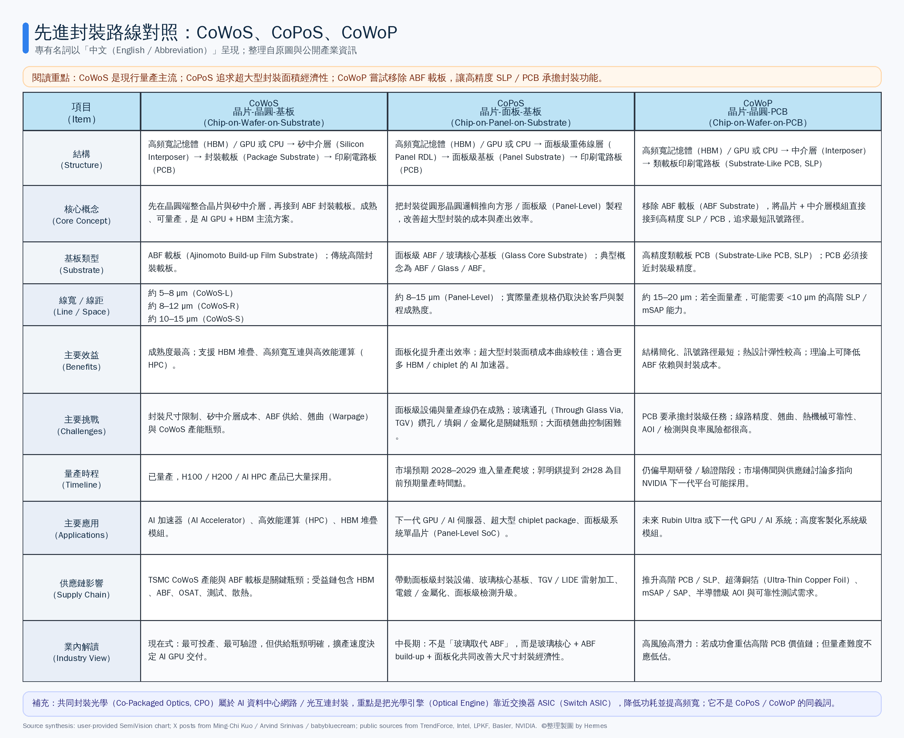

> 版本：2026-06-11  
> 定位：產業研究與供應鏈分析，不是買賣建議。X 貼文視為 market intelligence / 供應鏈線索；公開公司、媒體與技術資料為主要引用依據。  
> 這篇文章的重點不是背名詞，而是理解：**AI 晶片為什麼需要這些封裝？每一種封裝到底在解哪一層瓶頸？**

---

## 先用一張圖建立共同語言

---

## 封裝為什麼突然變成 AI 產業的主戰場？

過去談半導體競爭，最直覺的問題是「製程做到幾奈米」。但 AI accelerator 走到現在，單靠把一顆 logic die 做得更大、更先進，已經不能完整解釋效能提升。真正決定一台 AI 伺服器、甚至一座 AI factory 能不能有效運作的，是整個系統能不能把運算、記憶體、I/O、網路、供電與散熱接在一起，而且還要能量產、能維修、成本不能失控。

AI GPU / ASIC 最需要的不是孤立的算力，而是能夠持續餵資料給運算單元的記憶體頻寬。這就是為什麼 HBM 變得這麼重要。但 HBM 不是插上去就好，它必須非常靠近 GPU / ASIC，才能提供足夠高的頻寬與足夠低的延遲。於是封裝不再只是後段製程，而變成 AI 晶片架構的一部分：封裝負責把 GPU、HBM、chiplet、I/O 與基板整合成可工作的高效能模組。

問題是，AI package 一代比一代大。更多 HBM、更大的 GPU、更複雜的 chiplet、更高的功耗密度，都會把傳統封裝的成本、良率、翹曲與產能推到極限。這時候，CoWoS、CoPoS、CoWoP、CPO 這些名詞才會一起浮上檯面。它們不是一串炫技縮寫，而是產業在不同層級遇到瓶頸後，提出的不同解法。

可以把整件事濃縮成一句話：**CoWoS 解決今天 GPU 與 HBM 怎麼量產整合；CoPoS 解決下一代超大型 package 怎麼做得更大且更有經濟性；CoWoP 想挑戰 ABF 載板與 PCB 的邊界；CPO 則把封裝戰爭延伸到 AI data center 的網路交換器。**

---

## CoWoS 是現在的答案，但也是下一個瓶頸的起點

CoWoS（Chip-on-Wafer-on-Substrate，晶片-晶圓-基板）之所以成為 AI GPU 主流，是因為它很直接地解決了「GPU / ASIC 怎麼跟 HBM 高速溝通」這個問題。典型的 CoWoS 結構，是把 GPU / ASIC 與 HBM 放在矽中介層（Silicon Interposer）或類似高密度互連結構上，再接到 ABF 封裝載板，最後進入 PCB 與系統。這樣做的目的很單純：縮短訊號路徑，提高頻寬，降低延遲，讓 GPU 不會因為等資料而浪費算力。

從產業角度看，CoWoS 的最大優勢不是概念新，而是它已經被量產驗證。Basler 的 CoWoP 技術文章也把 CoWoS 描述為已成熟並支撐 NVIDIA H100 / H200 等 AI accelerator 的主流先進封裝。[^basler-cowop] 對供應鏈而言，CoWoS 已經形成一整套生態：TSMC advanced packaging capacity、ABF substrate、HBM、OSAT、測試、散熱模組全部圍繞它運作。

但 CoWoS 的成功，也正是它開始吃緊的原因。AI GPU 的 package 越做越大，矽中介層面積越大，成本越高；ABF substrate 尺寸越大，良率與翹曲越難控制；CoWoS 產能越關鍵，任何擴產延遲都會影響 AI accelerator 交付。也就是說，CoWoS 不是要被立刻取代，而是它已經做到太核心、太滿載，因此產業必須為更大的下一代 package 找新方法。

這就是 CoPoS 出現的原因：不是因為 CoWoS 不行，而是因為下一代 AI package 可能大到需要新的製造邏輯。

---

## CoPoS 的重點不是玻璃題材，而是超大型封裝需要新的面積經濟性

CoPoS（Chip-on-Panel-on-Substrate，晶片-面板-基板）常被簡化成玻璃基板題材，但這樣理解會偏掉。真正的重點是：當 AI package 變得非常大，用圓形 wafer 去做超大型矩形封裝，面積利用率與成本曲線會變得越來越不漂亮；如果能把製程推向 panel-level，用更大的方形面板處理更多封裝單元，理論上就能改善超大型 package 的產出效率與經濟性。

郭明錤在 X 上提到，CoPoS 目前預期 2H28 量產，目標是改善 9.5x reticle-size 以上超大型封裝的經濟性，並提到 310 × 310 mm temporary glass carrier，以及 250 × 250 pilot / 510 × 515 mass production glass panel 等尺寸線索。[^kuo-copos] TrendForce 引述 Commercial Times 的報導也指出，TSMC CoPoS pilot line 已開始導入設備，市場預期 volume production 可能在 2028–2029 ramp；但同時也提醒，substrate size 放大後，warpage 是主要量產挑戰。[^trendforce-copos]

這裡的玻璃核心基板（Glass Core Substrate）重要，但它不是大家想像的「晶片直接放在玻璃上」。比較正確的理解是 ABF / Glass / ABF：玻璃在中間提供平坦度、尺寸穩定性與機械支撐；上下兩側的 ABF build-up layers 仍然負責細線路與 chip attach。Intel 在 glass substrate 資料中指出，相比 organic substrate，玻璃具備更好的平坦度、熱機械穩定性與尺寸穩定性，並可能支援更高 interconnect density，適合 data center、AI、graphics 等大型高效能封裝。[^intel-glass]

所以 CoPoS 的本質不是「玻璃取代 ABF」，也不是「玻璃 interposer」。它比較像是：**用 glass core 的穩定性，加上 ABF 的線路能力，再配合 panel-level 製程，去支撐更大、更複雜的 AI package。**

真正困難的是 TGV（Through Glass Via，玻璃通孔）。玻璃本身不導電，訊號與電源要穿過 glass core，就必須在玻璃上形成大量微孔，並完成填銅 / 金屬化。Arvind Srinivas 的 X 貼文指出，CoPoS glass core substrate 是 ABF / Glass / ABF 三層堆疊，而 TGV 是關鍵瓶頸。[^arvind-copos] LPKF 的 LIDE 技術資料則提到，其玻璃加工可透過 ultrafast laser modification + wet etching 製作 through-glass vias，並標示 aspect ratio 可達 up to 1:50、sub-micron accuracy，以及 zero micro-cracks / chipping 等能力。[^lpkf-lide]

這裡才是供應鏈研究的重點。CoPoS 不是看到「玻璃」兩個字就全部受惠，而是要看誰能通過客戶 qualification，解掉 TGV、玻璃加工、Cu filling / metallization、panel-level lithography、warpage control 與 inspection。若這些瓶頸解不掉，CoPoS 就只是漂亮 roadmap；若解得掉，它會把 TSMC 的先進封裝優勢從今天的 CoWoS 延伸到下一代 ultra-large AI package。

---

## CoWoP 更激進：它問的是，封裝載板一定要存在嗎？

如果說 CoPoS 是把封裝載板做得更大、更穩、更適合 panel-level，那 CoWoP（Chip-on-Wafer-on-PCB，晶片-晶圓-PCB）問的問題更激進：既然 ABF substrate 貴、供給緊、尺寸放大後又難做，那能不能把傳統封裝載板拿掉，讓高精度類載板 PCB（Substrate-Like PCB, SLP）直接承擔更多封裝功能？

這個想法之所以吸引人，是因為它理論上可以讓訊號路徑更短、結構更簡化、熱路徑更直接，也可能減少對 ABF substrate 的依賴。Basler 對 CoWoP 的描述是，它把 package substrate 與 PCB 整合成單一結構，使模組更薄、頻寬更高、熱性能更好；但同時也指出，整個 PCB supply chain 必須達到 semiconductor-grade accuracy。[^basler-cowop]

這句話其實已經點出 CoWoP 最大的風險：普通 PCB 不是封裝載板。CoWoP 要求 PCB / SLP 做到接近半導體封裝級的線路精度、層間對位、低翹曲、材料穩定性與檢測能力。Basler 文中提到 CoWoP 可能需要 15–20 µm line / space 的能力，並面臨多層結構、翹曲、材料穩定性與半導體級檢測挑戰。[^basler-cowop] 如果未來規格繼續往 <10 µm 靠近，普通 PCB 產能幾乎沒有意義，只有真正能做高階 SLP、mSAP / SAP、低翹曲與高良率檢測的廠商才可能進入核心供應鏈。

所以 CoWoP 不是「PCB 股全部受惠」。它比較像是 PCB 產業的一場升級淘汰賽：成功者會從系統板供應商往封裝功能供應商靠近，價值量可能提高；失敗者則只是被市場題材短暫照到，財報不一定跟上。這也是為什麼 CoWoP 比 CoPoS 更不能只看概念，必須看客戶驗證、製程能力、良率責任與可靠性數據。

---

## CPO 是另一層問題：不是封 GPU，而是讓 AI factory 網路不要被功耗拖垮

共同封裝光學（Co-Packaged Optics, CPO）常被放在同一串名詞裡，但它跟 CoWoS / CoPoS / CoWoP 解的不是同一個問題。CoWoS、CoPoS、CoWoP 主要在討論 AI accelerator package：GPU / ASIC、HBM、interposer、substrate、PCB 怎麼整合。CPO 討論的是 data center networking：switch ASIC 要怎麼用更低功耗、更高可靠度連到光纖網路。

AI cluster 越大，GPU 之間、rack 之間、switch 之間的資料交換越誇張。傳統 pluggable transceiver 架構下，訊號要從 switch ASIC 經過 PCB、connector，再到前面板光模組才轉成光訊號。速度越高，這段 electrical path 的 loss、功耗、熱與故障點就越難接受。NVIDIA 的 CPO 技術文章指出，傳統 200 Gbps channel 的 electrical loss 可高達 22 dB；把 electro-optical conversion 放到 switch package 旁後，loss 可降到約 4 dB，每 interface 功耗可從常見 30W 降到 as low as 9W。NVIDIA 也宣稱其 CPO-based systems 可帶來 up to 3.5x power efficiency 與 10x resiliency improvement，Quantum-X / Spectrum-X Photonics 商用時間指向 2026。[^nvidia-cpo]

換句話說，CPO 的核心不是「把 AI GPU 封得更大」，而是「把光學引擎放到交換器 ASIC 旁邊，減少高速電訊號走太遠造成的損耗」。因此 CPO 的供應鏈也不同：它看的是 laser source、silicon photonics / PIC、optical engine、fiber attach、FAU、optical testing、switch system integration。真正的瓶頸會在 laser reliability、optical engine yield、fiber alignment 自動化、optical test throughput 與系統維修性，不會平均灑到所有光通概念股。

---

## 投資研究的主線：不要買名詞，要找瓶頸

這輪先進封裝最容易犯的錯，是把所有技術都變成一籃子概念股：CoWoS 等於 ABF，CoPoS 等於玻璃，CoWoP 等於 PCB，CPO 等於光通。這樣分類太粗，容易買到的是敘事，不是財報。

更好的做法是回到瓶頸。CoWoS 的瓶頸在 TSMC advanced packaging capacity、ABF substrate、HBM allocation、測試與散熱；CoPoS 的瓶頸在 glass core substrate、TGV / LIDE、Cu filling / metallization、panel-level lithography、warpage control 與 inspection；CoWoP 的瓶頸在高階 SLP / PCB、mSAP / SAP、超薄銅箔、半導體級 AOI、低翹曲與可靠性；CPO 的瓶頸在 laser source、silicon photonics / PIC、optical engine、fiber attach、optical testing 與 switch system integration。

投資上真正要問的，不是「這家公司有沒有沾到題材」，而是：它是否卡在不可替代的瓶頸？是否有客戶 qualification？是否有規格升級帶來 ASP 或毛利率改善？是否能從樣品走到量產？是否在財報上看得到 revenue mix 變化？如果答案都沒有，那就只是概念；如果答案逐步變成 yes，才可能從題材變成 alpha。

---

## 最後用一句話收斂

先進封裝不是半導體製程後面的附屬品，而是 AI 系統架構本身的一部分。CoWoS 讓今天的 GPU + HBM 能量產；CoPoS 是為下一代超大型 package 尋找更好的面積與成本曲線；CoWoP 嘗試把 PCB 推進封裝核心；CPO 則讓 AI factory 的網路層不被功耗與訊號損耗拖垮。

所以，研究這個題材時不要從縮寫開始，而要從系統瓶頸開始。**AI 系統越大，資料越多，封裝就越像控制權。誰能在下一個瓶頸層被客戶驗證，誰才有機會把技術敘事變成營收、毛利率與估值重估。**

---

## Sources

[^kuo-copos]: 郭明錤｜Ming-Chi Kuo, “Key takeaways on TSMC's next-generation advanced packaging, CoPoS,” X, 2026-06-11. https://x.com/mingchikuo/status/2064896082203849094?s=20

[^arvind-copos]: Arvind Srinivas, “CoPoS's glass core substrate is a 3-layer stack: ABF / glass / ABF… TGV is the Bottleneck…,” X, 2026-06-11. https://x.com/arv9293/status/2064955872250388728?s=20

[^trendforce-copos]: TrendForce, “[News] TSMC Advances Panel-Level Packaging, CoPoS Pilot Line Reportedly Set for June Completion, 2028–29 Ramp Eyed,” 2026-04-13. https://www.trendforce.com/news/2026/04/13/news-tsmc-advances-panel-level-packaging-copos-pilot-line-reportedly-set-for-june-completion-2028-29-ramp-eyed/

[^intel-glass]: Intel, “Intel Unveils Industry-Leading Glass Substrates to Meet Demand for More Powerful Compute,” 2023. https://www.intc.com/news-events/press-releases/detail/1647/intel-unveils-industry-leading-glass-substrates-to-meet

[^lpkf-lide]: LPKF, “LIDE® Technology: Industry Standard for Advanced Glass Processing.” https://lide.lpkf.com/en/technology/lide

[^basler-cowop]: Basler, “CoWoP Is Coming, and Semiconductor Inspection Is Ready All Along.” https://www.baslerweb.com/en/learning/semicon-chip-on-wafer-on-pcb/

[^nvidia-cpo]: NVIDIA Technical Blog, “Scaling AI Factories with Co-Packaged Optics for Better Power Efficiency,” 2026. https://developer.nvidia.com/blog/scaling-ai-factories-with-co-packaged-optics-for-better-power-efficiency/
