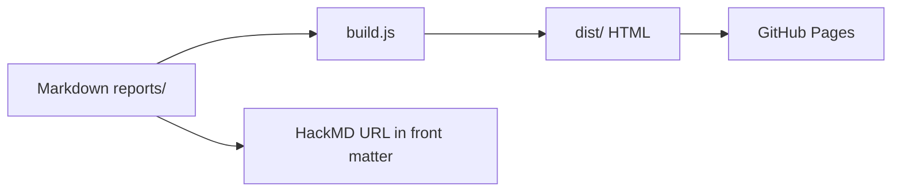

[[toc]]

## 摘要

這是一份範例報告。每篇正式報告都應保留 Markdown 原文在 `reports/`，並可用 `hackmd_url` 連到 HackMD 主發布版。

## 表格

| 項目 | 說明 |
| --- | --- |
| Local copy | `reports/<category>/<slug>.md` |
| HTML output | `dist/reports/<category>/<slug>.html` |
| Deployment | GitHub Pages Actions |

## Mermaid

## Footnote

研究報告需要來源連結與清楚區分事實 / 推論。[^discipline]

[^discipline]: 這裡只是 renderer sample；正式研究內容仍需要逐條引用來源。
