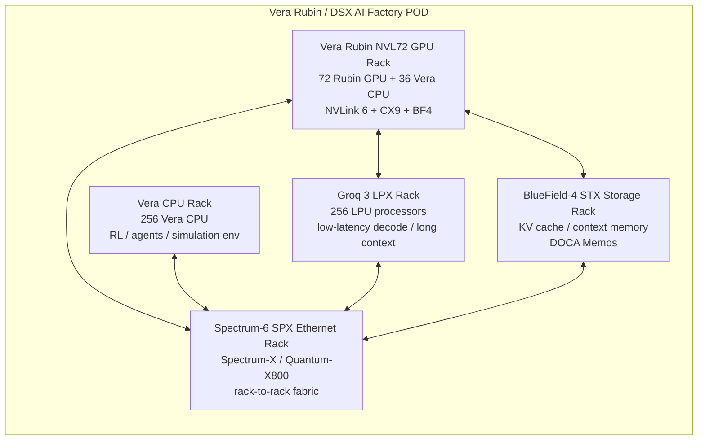
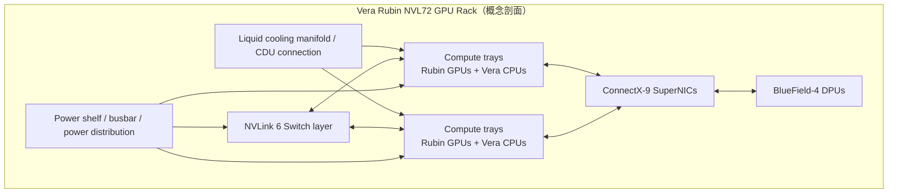
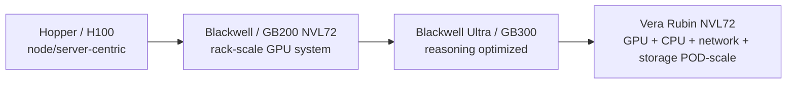

> 版本：2026-05-25  
> 立場：以 NVIDIA 官方 2026 CES/GTC 新聞稿與 DSX reference design 公開資訊為主；供應鏈解讀為推論，非投資建議。

---

## 0. Executive summary

Vera Rubin 不是單一 GPU，而是一套 **rack / POD-scale AI factory 平台**。NVIDIA 的設計方向已經從「賣 GPU 卡」進一步變成「把 compute、networking、storage、power、cooling 都一起 co-design」。

最核心的 GPU rack 是 **NVIDIA Vera Rubin NVL72 Rack**：

- **72 顆 Rubin GPU**
- **36 顆 Vera CPU**
- 透過 **NVLink 6** 做 rack 內 scale-up
- 搭配 **ConnectX-9 SuperNIC**、**BlueField-4 DPU**
- 對外再用 **Quantum-X800 InfiniBand** 或 **Spectrum-X / Spectrum-6 Ethernet** 做 scale-out
- 液冷、高密度、以 MoE / reasoning / agentic inference 為主要 workload

NVIDIA 2026 GTC 對 Vera Rubin 的描述更像一個「五種 rack 組成的 AI factory building block」：

1. **Vera Rubin NVL72 GPU racks** — 主要訓練與推論 compute
2. **Vera CPU racks** — CPU-based RL / agent environment / simulation
3. **Groq 3 LPX inference accelerator racks** — 低延遲、大 context inference decode acceleration
4. **BlueField-4 STX storage racks** — AI-native context / KV cache storage layer
5. **Spectrum-6 SPX Ethernet racks** — rack-to-rack east-west traffic networking

簡化成一句話：**Vera Rubin 是 NVIDIA 把 GPU rack 擴成 AI factory POD 的第一代完整 reference platform。**

---

## 1. 一張圖理解 Vera Rubin

---

## 2. Vera Rubin 的基本 component

### 2.1 Compute：Vera CPU + Rubin GPU

**Vera CPU**

- NVIDIA 自家的 CPU，放在 NVL72 GPU rack 內，也可形成獨立 CPU rack。
- 在 GPU rack 中，官方配置是 **36 Vera CPUs 對 72 Rubin GPUs**。
- 在 Vera CPU rack 中，官方說法是 **256 Vera CPUs**，built on NVIDIA MGX，液冷。
- 用途不是傳統 general-purpose server CPU 而已，而是為 agentic AI / RL workloads 的大量 CPU environment、simulation、validation 做 scale-out。

**Rubin GPU**

- Vera Rubin NVL72 rack 的主要 AI compute 元件。
- NVIDIA 強調相對 Blackwell：MoE training 可用約 1/4 GPU 數量；inference throughput per watt 可達 10x、token cost 約 1/10。這是官方口徑，實際 TCO 仍取決於模型、utilization、datacenter power/cooling 條件。

### 2.2 Scale-up fabric：NVLink 6 + NVLink Switch

- **NVLink 6** 是 rack 內 GPU/CPU 高頻寬互連的核心。
- Vera Rubin NVL72 不是把 72 顆 GPU 當 72 台分散伺服器，而是要讓它們像一個大 shared-memory / tightly-coupled accelerator pool。
- 對 AI workload 的意義：MoE、long context、reasoning、多 GPU synchronization 的溝通成本下降。

### 2.3 Scale-out network：ConnectX-9、Spectrum-6、Quantum-X800

**ConnectX-9 SuperNIC**

- 每個 compute rack 對外連接 fabric 的高階 NIC。
- 負責 GPU rack 與 GPU rack、storage rack、CPU rack 之間的高速連線。

**Spectrum-6 / Spectrum-X Ethernet**

- NVIDIA 把 Ethernet fabric 也納入 AI factory reference design。
- 官方 SPX Ethernet rack 強調 east-west traffic、低延遲、高吞吐。
- Spectrum-X Ethernet Photonics / CPO 方向被 NVIDIA 強調：相對傳統 pluggable transceiver，官方稱可達 5x optical power efficiency、10x resiliency。

**Quantum-X800 InfiniBand**

- 另一個 scale-out fabric 選項。
- 對 hyperscale training cluster，InfiniBand 仍是 NVIDIA 高端 AI cluster 的重要路線。

### 2.4 Data / storage：BlueField-4 DPU + STX storage rack

**BlueField-4 DPU**

- 在 compute rack 內做 networking、security、storage offload。
- 在 STX storage rack 中，BlueField-4 被 NVIDIA 定位成 AI-native storage processor。

**STX storage rack / context memory**

- NVIDIA 明確把 LLM / agent 的 **KV cache / context memory** 當成獨立 rack-scale storage tier。
- 這是很重要的架構變化：long-context / multi-turn agent 不只是 GPU FLOPS 問題，也需要大量、高頻寬、低延遲的 context/KV cache 存取。

### 2.5 Power / cooling / physical infrastructure：DSX

Vera Rubin 也牽涉資料中心層級設計：

- liquid cooling
- power distribution / dynamic power provisioning
- facility-level digital twin
- rack / POD / AI factory reference design

NVIDIA DSX 的目的，是把 compute、networking、storage、power、cooling 整合進 reference design，讓客戶更快從設計走到 first token / first revenue。

---

## 3. 機櫃會長什麼樣子？

### 3.1 官方圖像觀察

NVIDIA 官方 Vera Rubin family 圖顯示的不是單一 server，而是一排高密度 rack / cabinet。視覺上接近：

- 多個黑色資料中心機櫃並排
- 前方/旁邊展示 Vera CPU、Rubin GPU、NVLink switch、NIC/DPU/switch chips
- 整體被包裝成「一組 AI factory rack family」而不是單台 HGX server
- GPU rack / CPU rack / storage rack / network rack 是分工的

官方圖：

### 3.2 NVL72 GPU rack 的概念剖面

> 注意：上圖是根據 NVIDIA 公開 component 進行的概念剖面，不是 NVIDIA 官方 mechanical drawing。實際 tray 數、switch placement、busbar、manifold 位置要看 OEM/ODM 實作。

---

## 4. 五種 rack 的功能分工

### 4.1 Vera Rubin NVL72 GPU Rack

定位：AI compute core。

公開配置：

- 72 Rubin GPUs
- 36 Vera CPUs
- NVLink 6
- ConnectX-9 SuperNICs
- BlueField-4 DPUs

適合 workload：

- large MoE model training
- post-training
- test-time scaling
- agentic inference
- multimodal / long-context inference

### 4.2 Vera CPU Rack

定位：CPU environment / agent simulation / RL scaling。

公開配置：

- 256 Vera CPUs
- NVIDIA MGX
- liquid-cooled
- Spectrum-X Ethernet integration

為什麼需要 CPU rack？

Reasoning / agent / RL 不是只有 GPU matrix multiplication。大量 agent 需要在 CPU-based environments 裡跑工具、模擬、驗證、資料查詢與狀態管理。GPU 生成 action，CPU side environment 回傳 observation / reward / validation，兩者需要同步。

### 4.3 Groq 3 LPX Rack

定位：低延遲、大 context inference acceleration。

公開配置：

- 256 LPU processors
- 128GB on-chip SRAM
- 640 TB/s scale-up bandwidth

重點：NVIDIA 2026 GTC 宣布把 Groq 3 LPU 整合進 Vera Rubin platform。LPX rack 和 Rubin GPU 共同服務每個 output token 的每一層計算，官方定位是提升 decode / long-context / trillion-parameter inference 效率。

### 4.4 BlueField-4 STX Storage Rack

定位：AI-native context memory / KV cache storage。

公開功能：

- rack-scale storage system
- 由 BlueField-4 驅動
- 把 Vera CPU + ConnectX-9 SuperNIC 用於 storage / context layer
- DOCA Memos framework 處理 KV cache storage

這是 agentic AI 很重要的一環：如果 model context、multi-turn history、retrieved context、KV cache 都變大，memory / storage hierarchy 會直接影響推論吞吐與 latency。

### 4.5 Spectrum-6 SPX Ethernet Rack

定位：AI factory east-west network。

公開功能：

- 可配置 Spectrum-X Ethernet 或 Quantum-X800 InfiniBand switches
- 低延遲、高吞吐 rack-to-rack connectivity
- Spectrum-X Ethernet Photonics / CPO 方向：提高 optical power efficiency 與 resiliency

---

## 5. 跟 Blackwell / GB300 的關係

Vera Rubin 是 Blackwell / Blackwell Ultra 後的下一代 rack-scale 平台。可以這樣理解：

重點不是只有 GPU 性能提升，而是：

- rack 內：NVLink generation upgrade
- rack 外：networking / photonics / Ethernet / InfiniBand co-design
- storage：context memory / KV cache 變成獨立系統
- CPU：Vera CPU 被拉進 platform-level design
- facility：DSX 把 power/cooling/digital twin 也納入

---

## 6. 供應鏈觀察：哪些 component 可能受益？

### 6.1 高可信度受益方向

1. **液冷 / CDU / manifold / quick disconnect / cold plate**
   - Vera Rubin NVL72 與 Vera CPU rack 都明確是高密度液冷方向。
   - 觀察重點：rack power density、CDU attach rate、direct-to-chip cooling、leak detection、管路與接頭可靠度。

2. **高速互連 / cable / connector / backplane**
   - NVLink 6、ConnectX-9、Spectrum-6、InfiniBand/Ethernet fabric 都推高高速連接需求。
   - 觀察重點：copper cable、active electrical cable、retimer、high-speed connector、backplane loss budget。

3. **光通訊 / CPO / silicon photonics**
   - Spectrum-X Ethernet Photonics / co-packaged optics 是官方明確提到的方向。
   - 觀察重點：800G/1.6T、CPO、LPO、SiPh、EML/CW laser、optical engine、光模組封裝測試。

4. **Power delivery / PSU / busbar / power shelf / BBU**
   - rack-scale GPU system 需要更高效率 power conversion 與更高可靠度配電。
   - 觀察重點：48V 架構、power shelf、busbar、VRM、BBU、solid capacitor、high-current inductor。

5. **PCB / HDI / substrate / advanced packaging 周邊**
   - 高速訊號、GPU package、switch ASIC、NIC/DPU 都提高 PCB 與 substrate 規格。
   - 觀察重點：layer count、low-loss material、ABF substrate、CoWoS/advanced packaging capacity。

### 6.2 要小心的地方

- 不要把所有 AI server 供應鏈都等同受益。Vera Rubin 對 **power/cooling/network/storage** 的增量可能比傳統 server BOM 更重要。
- NVL72 是官方目前 Vera Rubin GPU rack 口徑；若市場文章提 NVL144 / NVL576，需確認是 roadmap、Rubin Ultra、cluster scaling，還是非官方推測。
- 真正投資上要看：客戶導入時程、ASP、良率、認證、產能、毛利率，而不是只看「有進 NVIDIA supply chain」。

---

## 7. 後續追蹤指標

1. NVIDIA 是否公開 Vera Rubin NVL72 的完整 rack spec：功耗、rack power、cooling flow rate、memory capacity、NVLink bandwidth。
2. OEM/ODM：Dell、HPE、Lenovo、Supermicro、Foxconn、QCT、Wiwynn、Inventec、Pegatron、Wistron 的 Vera Rubin product announcement。
3. 網通與光通訊：Spectrum-6 / Spectrum-X Photonics / CPO 實際導入比例。
4. 液冷：rack power density 與 direct liquid cooling attach rate。
5. Storage/context memory：BlueField-4 STX / DOCA Memos 是否真正進入 hyperscaler deployment。
6. Agentic AI workload：RL、test-time scaling、long-context inference 是否成為大規模商業 workload。

---

## 8. Sources

- NVIDIA Newsroom, **NVIDIA Kicks Off the Next Generation of AI With Rubin — Six New Chips, One Incredible AI Supercomputer**, 2026-01-05  
  https://nvidianews.nvidia.com/news/rubin-platform-ai-supercomputer
- NVIDIA Newsroom, **NVIDIA Vera Rubin Opens Agentic AI Frontier**, 2026-03-16  
  https://nvidianews.nvidia.com/news/nvidia-vera-rubin-platform
- NVIDIA Newsroom, **NVIDIA Releases Vera Rubin DSX AI Factory Reference Design and Omniverse DSX Digital Twin Blueprint With Broad Industry Support**, 2026-03-16  
  https://nvidianews.nvidia.com/news/nvidia-releases-vera-rubin-dsx-ai-factory-reference-design-and-omniverse-dsx-digital-twin-blueprint-with-broad-industry-support
- NVIDIA Newsroom, **NVIDIA Blackwell Ultra DGX SuperPOD Delivers Out-of-the-Box AI Supercomputer for Enterprises to Build AI Factories**, 2025-03-18  
  https://nvidianews.nvidia.com/news/blackwell-ultra-dgx-superpod-supercomputer-ai-factories
