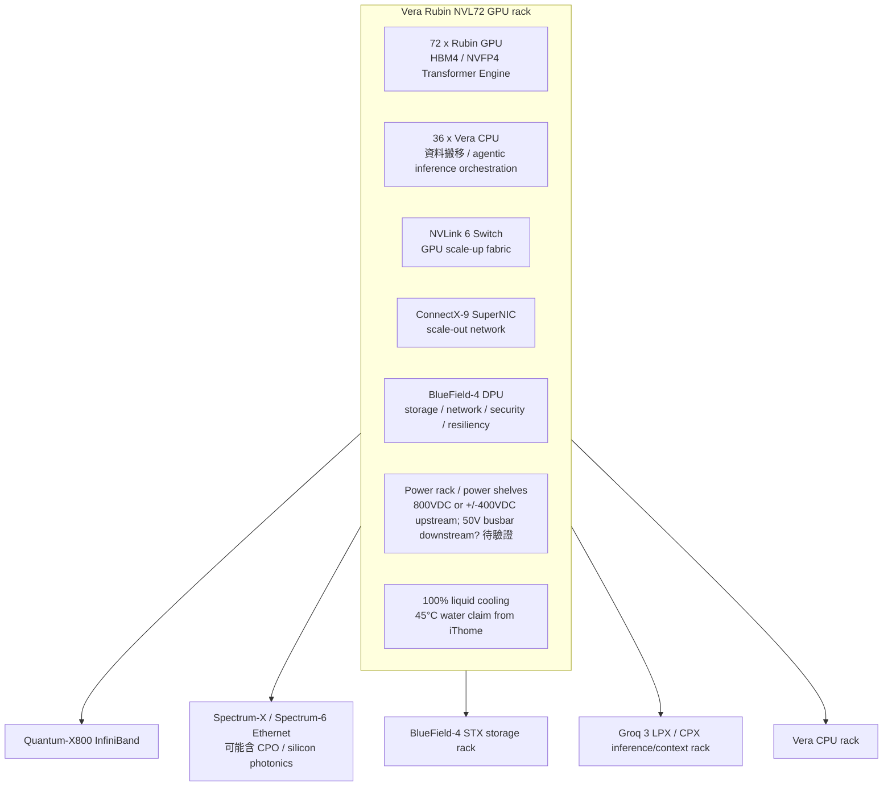

# Vera Rubin 自動研究索引：文章、架構與機櫃線索

> 版本：2026-05-26 初版。這份先做「研究索引 + 架構地圖」，不是最後報告。後續會把每篇文章拆成摘要卡、引用片段、供應鏈推論與待驗證問題。

## 0. 先講結論

【事實】NVIDIA 已把 Vera Rubin 包裝成「rack-scale AI supercomputer / AI factory」平台，而不是單一 GPU。官方頁面把 Vera Rubin NVL72 定義為整合 **72 顆 Rubin GPU、36 顆 Vera CPU、ConnectX-9 SuperNIC、BlueField-4 DPU**，以 **NVLink 6** 做機櫃內 scale-up，並用 Quantum-X800 InfiniBand / Spectrum-X Ethernet 做外部擴充的機架級平台。來源：NVIDIA Vera Rubin NVL72 產品頁、NVIDIA 官方部落格。[^nvl72][^nvblog]

【事實】NVIDIA 官方也把 Vera Rubin 平台拆成多種機架：Vera Rubin NVL72 GPU rack、Vera CPU rack、Groq 3 LPX inference accelerator rack、BlueField-4 STX storage rack、Spectrum-6 SPX Ethernet rack。來源：NVIDIA 官方部落格、iThome。[^nvblog][^ithome]

【推論】市場真正要研究的不是「Rubin GPU 比 Blackwell 強多少」而已，而是：NVIDIA 把 CPU、GPU、NVLink switch、NIC、DPU、Ethernet switch、power shelf、liquid cooling、tray / backplane / busbar 一起 co-design。這會把台灣供應鏈從「單板/單機」推向「整櫃、電源、液冷、背板、連接器、組裝良率」競爭。

【待驗證】Substack 上直接寫 Vera Rubin 的深文，目前可確認最關鍵的是 SemiAnalysis 的〈Vera Rubin – Extreme Co-Design〉，但該文標示 Paid；免費可讀片段已足以建立研究方向，完整細節不可當作已讀事實。其他免費文章多半是 GB200/GB300、CPO、AI datacenter power 的背景文，需要當成「Rubin 的前置脈絡」而不是 Rubin 直接證據。

---

## 1. 文章索引：先讀哪些

### A. 直接 Vera Rubin / NVL72

1. **NVIDIA — Vera Rubin 平台產品頁**  
   URL: https://www.nvidia.com/zh-tw/data-center/technologies/rubin/  
   重點：官方敘事中心；包括 Transformer Engine、第三代機密運算、NVLink 6、Rubin GPU / Vera CPU 等平台級說法。適合當 fact base，但效能倍數與 token cost 是 NVIDIA 自家口徑，需要標記為 vendor claim。

2. **NVIDIA — Vera Rubin NVL72 產品頁**  
   URL: https://www.nvidia.com/zh-tw/data-center/vera-rubin-nvl72/  
   重點：明確寫出 NVL72 的構成：72 Rubin GPU、36 Vera CPU、ConnectX-9、BlueField-4；NVLink 6 機櫃內擴充；Quantum-X800 / Spectrum-X 外部擴充；Rubin GPU 採 HBM4；NVLink 6 每 GPU 最高 3.6 TB/s scale-up bandwidth；ConnectX-9 每 GPU 1.6 Tb/s。[^nvl72]

3. **NVIDIA 官方部落格 — NVIDIA Vera Rubin 開啟代理型 AI 新前沿**  
   URL: https://blogs.nvidia.com.tw/blog/nvidia-vera-rubin-platform/  
   日期：2026-03-16  
   重點：列出七款晶片與五種機架，並宣稱 NVL72 用於大型 MoE 訓練時所需 GPU 數量為 Blackwell 平台的 1/4、每瓦推論 throughput 最高 10 倍、token cost 1/10。這些是官方宣稱，要與實際客戶 TCO、供電、良率交叉驗證。[^nvblog]

4. **SemiAnalysis — Vera Rubin – Extreme Co-Design: An Evolution from Grace Blackwell Oberon**  
   URL: https://newsletter.semianalysis.com/p/vera-rubin-extreme-co-design-an-evolution  
   作者：Wega Chu, Dylan Patel, Daniel Nishball 等；日期：2026-02-25；標示 Paid。  
   重點：目前看起來是最重要的 Substack / newsletter 深文。公開片段指出 Rubin 平台產品包含 Rubin GPU、Vera CPU、NVLink 6 Switch、ConnectX-9、BlueField-4、Spectrum-6；討論 seamless cableless compute tray、power rack、VR NVL72 TCO / BoM。免費片段提到 800VDC / ±400VDC power rack、compute tray 仍吃 50V busbar、四個 110kW power shelves、VR NVL72 TDP up to 220kW 等線索。因為付費，不能把內文未公開段落當作完整來源。[^semianalysis]

5. **iThome — Nvidia 發表 Vera Rubin 平臺，一口氣推 CPU、GPU、LPU 等 7 款晶片**  
   URL: https://www.ithome.com.tw/news/174444  
   日期：2026-03-17  
   重點：中文整理得相對完整：7 款晶片、5 款機架、100% liquid cooling、去除複雜纜線、45°C 水溫液冷、NVL72 內含 72 GPU / 36 CPU、單 GPU 50 PFLOPS NVFP4、HBM4。[^ithome]

6. **T客邦 — 黃仁勳深度解析 NVIDIA Vera Rubin 系統，六大晶片打造 AI 怪獸**  
   URL: https://www.techbang.com/posts/127525-nvidia-jensen-huang-ces-2026-vera-rubin-6-chips  
   重點：用比較白話的方式解釋 Vera CPU、Rubin GPU、ConnectX-9、BlueField-4、NVLink 6、Spectrum-X 等六種晶片如何分工；提到 compute tray 走 cableless / no hoses / no fans 的方向。[^techbang]

7. **NVIDIA GTC Session — Power Solution for NVIDIA Vera Rubin and 800 VDC AI Rack Architecture, LITEON**  
   URL: https://www.nvidia.com/zh-tw/gtc/session-catalog/sessions/gtc26-ex82089/  
   重點：這是電源架構的關鍵入口。官方 session 摘要說 Vera Rubin 的性能跳升帶來 rack power design 挑戰，Lite-On 共同開發 **3RU 110kW power shelf**，三相 AC input PSU 與控制系統，對應 rack-level power management。[^liteon]

8. **Hashrate Index — NVIDIA Vera Rubin NVL72: Full Specs & Platform Breakdown**  
   URL: https://hashrateindex.com/blog/nvidia-vera-rubin-nvl72-specs-breakdown/  
   重點：非官方彙整，數字列得很完整：72 GPU / 36 CPU、3.6 EFLOPS NVFP4 inference、2.5 EFLOPS training、Rubin GPU 288GB HBM4 / 22TB/s / 336B transistors、Vera CPU 88 Olympus cores 等。可作二級來源，但數字要回頭對官方或 SemiAnalysis 交叉驗證。[^hashrate]

9. **NVIDIA — Rubin CPX / Vera Rubin NVL144 CPX**  
   URL: https://blogs.nvidia.com.tw/blog/nvidia-unveils-rubin-cpx-a-new-class-of-gpu-designed-for-massive-context-inference/  
   日期：2025-09-09  
   重點：這是 NVL72 之外的另一條線：Vera Rubin NVL144 CPX 在單一機架內宣稱 8 exaflops AI performance、100TB fast memory、1.7PB/s memory bandwidth，針對 million-token context / coding / video generation。[^cpx]

### B. 背景文：用來理解 Rubin，不可直接替代 Rubin 證據

- **GB200 / GB300 NVL72 官方與供應商資料**：理解 NVL72 rack 形態、72 GPU / 36 CPU 的前代架構，以及為何 Rubin 會延續/改造 Oberon rack-scale 路線。  
  NVIDIA GB300 NVL72: https://www.nvidia.com/zh-tw/data-center/gb300-nvl72/  
  Supermicro GB300 NVL72 datasheet: https://www.supermicro.com/datasheet/datasheet_SuperCluster_GB300_NVL72.pdf

- **CPO / Spectrum-X photonics 相關官方資料**：Rubin / Spectrum-6 SPX 會把 networking power efficiency 與 CPO 拉進敘事。要拆供應鏈時，需要把 CPO 採用率、時程、哪些 switch sku 先導入分開看。

---

## 2. Vera Rubin 的基本 component map

### 讀法

- **GPU / CPU 不再是故事主角的全部**：Rubin GPU 是算力核心，但 NVIDIA 敘事已經把 Vera CPU、NVLink 6、NIC/DPU、Ethernet switch、儲存/推論 accelerator rack 一起綁成 AI factory。
- **NVLink 6 是機櫃內的邊界**：NVL72 的關鍵是 72 GPU 在一個低延遲、高頻寬 domain 內像一台大機器工作；外部再用 IB/Ethernet 橫向擴充。
- **電源與散熱是供應鏈勝負點**：SemiAnalysis 片段與 Lite-On GTC session 都指向 800VDC / 110kW power shelf / rack-level power management。這比單顆晶片規格更容易拉出台廠差異。

---

## 3. 機櫃會長什麼樣子？目前只能分三層回答

### 3.1 已知：官方形態

【事實】Vera Rubin NVL72 是 rack-scale system；官方描述是 72 Rubin GPU + 36 Vera CPU + NVLink 6 + ConnectX-9 + BlueField-4 的單一機櫃級平台。[^nvl72]

【事實】iThome 引述 NVIDIA 說法：平台採 100% 液冷、去除複雜纜線、45°C 水溫液冷。[^ithome]

### 3.2 高可信推論：會像 GB200/GB300 NVL72 的下一代，但 tray / power / cable 會更激進

【推論】如果把 GB200/GB300 NVL72 當上一代參考，Vera Rubin NVL72 仍會是高密度液冷機櫃，內部包含 compute trays、NVLink switch trays、power shelves / power rack、coolant distribution、busbar / backplane。但 Rubin 會更強調 cableless tray、整櫃 co-design、電源集中化。

### 3.3 不要過早下結論：600kW / 800VDC / 供應鏈 ASP 很容易被市場文誇大

【待驗證】市場文章常提 600kW rack、800VDC、整櫃單價數百萬美元。這些可以作為研究線索，但要分清楚：

- NVIDIA 正式規格 vs 供應鏈/券商估算。
- NVL72 GPU rack vs 旁邊的 power rack / in-row power architecture。
- 110kW power shelf 數量、N+1 設計、實際出貨 sku 的 TDP。
- 800VDC 是資料中心配電層、in-row power rack，還是 compute tray 入口電壓。SemiAnalysis 片段反而指出 compute tray / busbar 仍可能在 50V，800VDC 需要在 power rack 轉換。[^semianalysis]

---

## 4. 視覺資料候選

1. **NVIDIA Vera Rubin NVL72 產品頁圖** — 直接官方視覺，適合做報告主圖與元件標註；注意這是產品宣傳圖。[^nvl72]
2. **NVIDIA Vera Rubin platform page** — 技術模組圖，適合做「七晶片平台」導讀。[^rubin]
3. **NVIDIA Rubin CPX blog 圖** — 用來區分 NVL72 與 NVL144 CPX / long-context 推論路線。[^cpx]
4. **GB300 NVL72 official / OEM visuals** — 用作「Rubin 機櫃外觀的前代參考」，不可說成 Rubin 實機。[^gb300]
5. **Supermicro GB300 NVL72 datasheet** — 可參考 liquid-cooled rack / SuperCluster 形態。[^smci]
6. **Lite-On GTC session** — 用作 power shelf / 800VDC 架構的研究入口。[^liteon]

---

## 5. 後續 autoresearch 工作清單

- [ ] 把 SemiAnalysis 文章拆成「免費片段可引用」與「付費不可引用」兩欄。
- [ ] 搜尋 Substack / newsletter 中非直接 Rubin、但能解釋 GB200/GB300 NVL72、CPO、AI datacenter power、液冷、NVLink fabric 的免費好文。
- [ ] 建立「Vera Rubin component → 台灣供應鏈」對照，但每家公司都要分成：產品證據、客戶/認證證據、財務證據。
- [ ] 做一張自製圖：NVL72 rack vs Vera CPU rack vs LPX/CPX context rack vs STX storage rack vs SPX Ethernet rack。
- [ ] 做一張「電源路徑」圖：grid / UPS / in-row power rack / 800VDC or ±400VDC / 50V busbar / tray VRM，並標記待驗證點。

---

## 6. 來源

[^rubin]: NVIDIA, “可擴充 AI 推理的基礎架構 | NVIDIA Vera Rubin 平台,” https://www.nvidia.com/zh-tw/data-center/technologies/rubin/
[^nvl72]: NVIDIA, “機架級代理型 AI 超級電腦 | NVIDIA Vera Rubin NVL72,” https://www.nvidia.com/zh-tw/data-center/vera-rubin-nvl72/
[^nvblog]: NVIDIA 台灣官方部落格, “NVIDIA Vera Rubin 開啟代理型 AI 新前沿,” 2026-03-16, https://blogs.nvidia.com.tw/blog/nvidia-vera-rubin-platform/
[^semianalysis]: SemiAnalysis newsletter, “Vera Rubin – Extreme Co-Design: An Evolution from Grace Blackwell Oberon,” 2026-02-25, https://newsletter.semianalysis.com/p/vera-rubin-extreme-co-design-an-evolution
[^ithome]: iThome, “Nvidia發表Vera Rubin平臺，一口氣推CPU、GPU、LPU等7款晶片，瞄準代理AI的AI工廠需求,” 2026-03-17, https://www.ithome.com.tw/news/174444
[^techbang]: T客邦, “黃仁勳深度解析NVIDIA Vera Rubin系統，六大晶片打造AI怪獸,” https://www.techbang.com/posts/127525-nvidia-jensen-huang-ces-2026-vera-rubin-6-chips
[^liteon]: NVIDIA GTC session catalog, “Power Solution for NVIDIA Vera Rubin and 800 VDC AI Rack Architecture (Presented by LITEON),” https://www.nvidia.com/zh-tw/gtc/session-catalog/sessions/gtc26-ex82089/
[^hashrate]: Hashrate Index, “NVIDIA Vera Rubin NVL72: Full Specs & Platform Breakdown,” https://hashrateindex.com/blog/nvidia-vera-rubin-nvl72-specs-breakdown/
[^cpx]: NVIDIA 台灣官方部落格, “NVIDIA 推出 Rubin CPX，專為大規模情境推論而打造的新一代 GPU,” 2025-09-09, https://blogs.nvidia.com.tw/blog/nvidia-unveils-rubin-cpx-a-new-class-of-gpu-designed-for-massive-context-inference/
[^gb300]: NVIDIA, “專為 AI 推理效能與效率而設計 | NVIDIA GB300 NVL72,” https://www.nvidia.com/zh-tw/data-center/gb300-nvl72/
[^smci]: Supermicro, “NVIDIA GB300 NVL72 Datasheet,” https://www.supermicro.com/datasheet/datasheet_SuperCluster_GB300_NVL72.pdf
